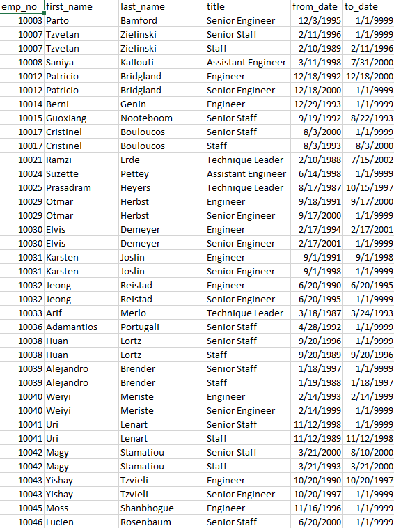
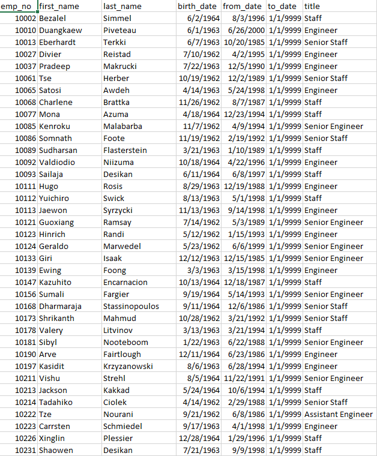

# Pewlett_Hackard_Analysis

## Overview
### In this project we were tasked to prepare for the "silver tsunami". In order to prepare we need to find the number of retiring employees by their title. After this has been done we needed to make a csv for eligible employees for the mentorship program.
## Results 
- A table that shows us all the employees born between 1952 and 1955.
- The number of people potentially retiring is found being around 90,398.
- Narrowed the titles that people will be retiring from this can help to check if downsizing is an option.
- Created a table telling us the people that are eligible for the mentorship program.
## Summary 
1. How many roles will need to be filled as the "silver tsunami" begins to make an impact? According to the information gathered should be 90,398.
2. Are there enough qualified, retirement-ready employees in the departments to mentor the next generation of Pewlett Hackard employees? There is not however if we went through and gave certain people a few each day it would help. There are 1,549 potential mentorship employees.

In order to help the company have an idea what the future holds, I made a new retirement titles table showing how many people may retire after the first intial "silver tsunami" This time looking for people born between 1956 to 1960.

Next I made another mentorship eligibilty table that looks at people that were born between 1962 to 1964 in order to even out the new hires to mentors.

